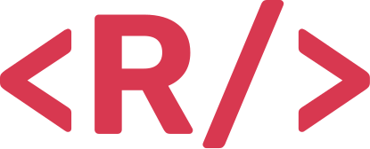

  

# Hi, I'm [Ruben](https://callmeruben.com) 👋

I'm a **professional web developer** who designs, implements and maintains high quality products.

My open source contributions have allowed hundreds of developers to kickstart their projects and **impacted thousands of users**.

Currently working as a **Systems Architect** at [Adway](https://adway.ai).

You can also find me on [LinkedIn](https://www.linkedin.com/in/ruben-harutyunyan/), [Twitter](https://twitter.com/Vagr9K) and on [my personal website](https://callmeruben.com).

## My latest [blog posts](https://callmeruben.com/blog)

<!-- BLOG-POST-LIST:START -->
- [Using N-API for high performance voice command detection in Discord](https://callmeruben.com/blog/using-n-api-for-high-performance-voice-command-detection-in-discord)
- [Material Design Framework comparison for React](https://callmeruben.com/blog/material-design-framework-comparison-for-react)
- [You need a fancy async prompt, and here&#39;s why](https://callmeruben.com/blog/you-need-a-fancy-async-prompt-and-heres-why)
- [Creating a native Powerline theme for Tmux](https://callmeruben.com/blog/creating-a-native-powerline-theme-for-tmux)
- [Tmux tips and tricks](https://callmeruben.com/blog/tmux-tips-and-tricks)
<!-- BLOG-POST-LIST:END -->
